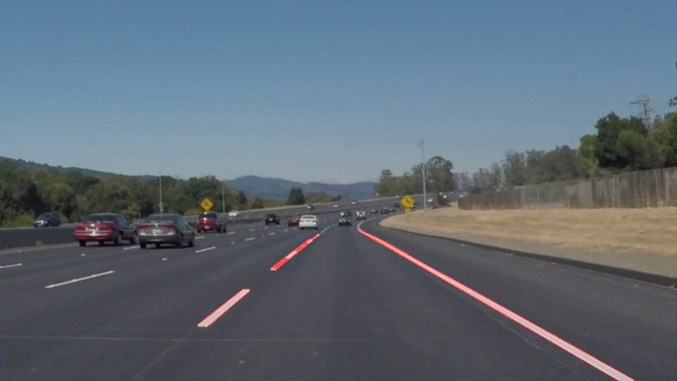

# **Finding Lane Lines on the Road** 

## **Overview**
---

This is my completed assignment for the Finding Lane Lines project of Udacity's Self Driving Car Engineer Nanodegree program.  I was given a template with some existing functions and asked to modify those functions and add others to complete the assignment.  The goal was to learn how to use computer vision techniques identify lane lines given images or videos taken from the car's perspective as it drives.

The assignment consisted of four objectives:
- Create a method to take a set of images and highlight the lane lines
- Implement that method on a video
- Edit the code to draw a continuous line of best fit for each lane line and implement that on a video
- Improve the code to better handle less than ideal lighting and contrast, then implement that on a video

## **Setup**
---

This code is written in a Jupyter Notebook using Python.  In order to run it, you will need a python environment with the necessary libraries.  You can follow Udacity's setup instructions for that here: [CarND Term1 Starter Kit](https://github.com/udacity/CarND-Term1-Starter-Kit/blob/master/README.md)

## **Use**
The code is contained in the Jupyter Notebook titled `P1_GJ.ipynb`.
The project takes the images in the directory `test_images/`, processes them, and saves the output in `test_images_output/`.  Videos are taken from `test_videos/`, processed, and the output saved in `test_videos_output/`

